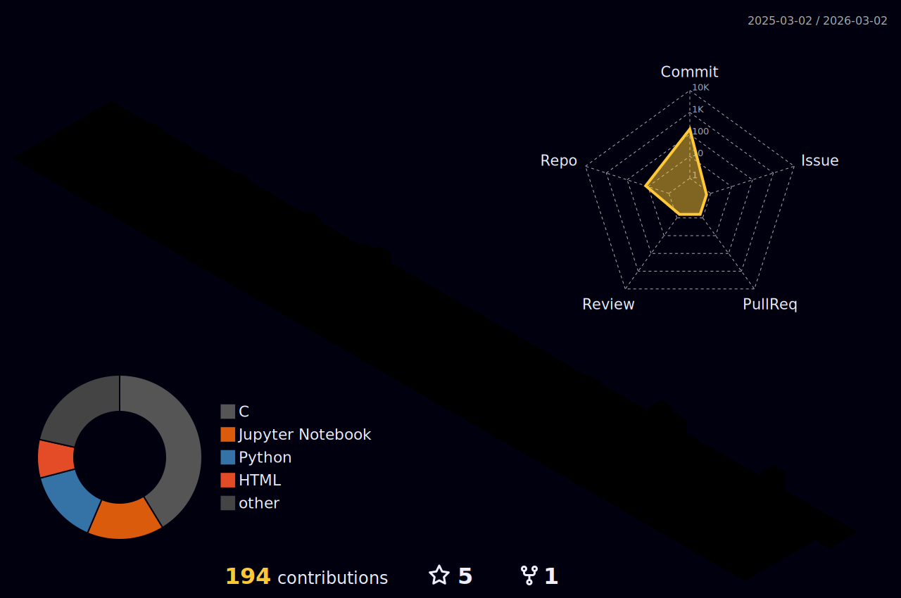

[;Electrical+Engineer+%7C+AI%2FML+Researcher;Pattern+Recognition+%7C+Biosignals;Welcome+to+my+GitHub)](https://git.io/typing-svg)

> **Alan M. Rocha** is a doctoral researcher in Signals and Systems at the Federal University of Ceará (UFC), specializing in signal and image processing. His academic background includes a Master's in Electrical and Computer Engineering (UFC, 2024), an MBA in Data Science and Analytics (USP/ESALQ, 2024), and a specialization in AI & Machine Learning (UNOPAR, 2023). He earned his Bachelor's in Electrical Engineering with a focus on computing from UFC (2021) and attended the Federal Institute of Ceará (IFCE) for his secondary education. His current research focuses on Machine Learning (ML), Deep Learning (DL), Explainable Neural Networks, and Pattern Recognition utilizing biosignals. ORCID: https://orcid.org/0000-0002-6446-0263

  
  

---

  
<b>Profile Visitor Count</b>

  

    
  

  

